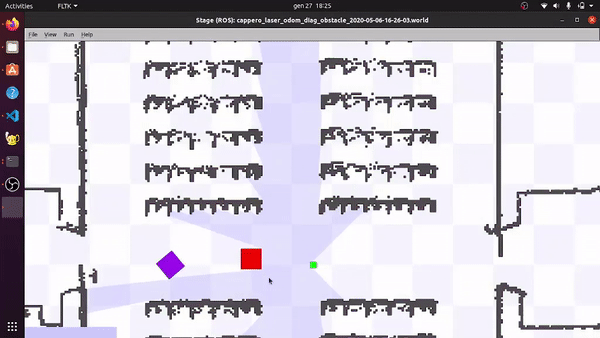

# Robot-Programming-Project
Project for the course [Robot Programming](https://sites.google.com/diag.uniroma1.it/robotprogramming202122/home)  :robot:, "Sapienza" University of Rome.
## Short description
Obstacle Avoidance : Build a node that computes a repulsive field from the local laser scans and modulates the /cmd_vel so that the robot does not clash to the wall if instructed to do so. It is written in C++. 

## How use it
1. Clone this repository into your ros workspace
2. Every time you open a new terminal: <pre><code>source devel/setup.bash </code> </pre>
3. From your workspace build with <pre><code>catkin_make</code></pre>
4. Start the roscore:<pre><code>roscore</code></pre>
5. In a different window: <pre><code>rosrun project project</code></pre>
6. In another window: <pre><code>rosrun stage_ros stageros cappero_laser_odom_diag_obstacle_2020-05-06-16-26-03.world</code></pre>I used a map of the [DIAG departament](https://www.diag.uniroma1.it/). There are 3 cubes: 
 :green_square: is the robot that is controlled;
 !:red_square: :purple_square: are the two obstacles.
  It is possible to set the dimension and the initial position in the `.world` file.
7. In a different window give the velocity command: <pre><code>rostopic pub /cmd_vel geometry_msgs/Twist -r 1 -- '[0.4, 0.0, 0.0]' '[0.0, 0.0, 0.0]'</code></pre> where the components are `[linear.x, linear.y, linear.z]` and `[angular.x, angular.y, angular.z]`  
  
## Info :man_technologist:
For any doubt or clarification send me an [email](mailto:betello.1835108@studenti.uniroma1.it?subject=[GitHub_Robot_Programming])
